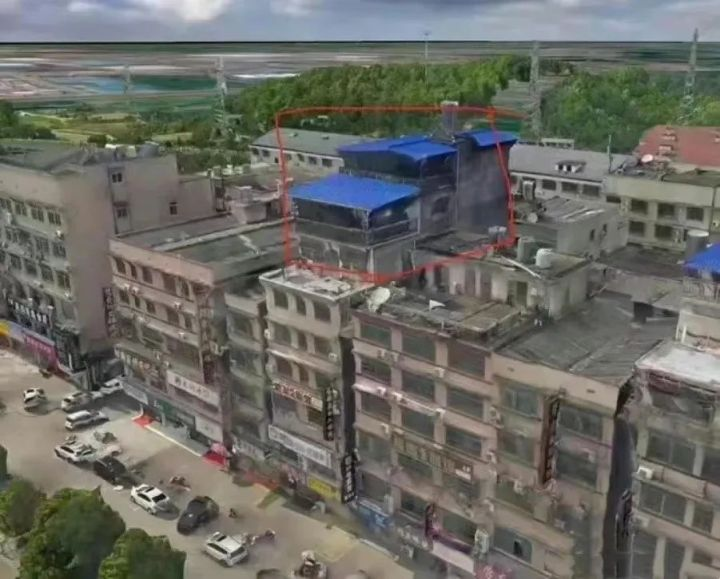

## 2022
### 5.11 长沙出台楼市新政，存量房供作租赁住房后，不纳入家庭住房套数计算
> 5月11日，长沙市培育和发展住房租赁市场工作领导小组正式印发《关于推进长沙市租赁住房多主体供给多渠道保障盘活存量房的试点实施方案》（以下简称《方案》）。   
> 根据《方案》，长沙通过全面打通新房、二手房、租赁住房市场“通道”，选择长房集团、长沙建房集团作为试点企业，开展盘活存量房供作租赁住房试点。《方案》施行之前已实现网签备案交房或已办理不动产登记的房屋，盘活供作租赁住房后，不纳入家庭住房套数计算。通过试点，既提高存量房源利用率，又增加租赁住房供给，稳定住房租赁市场，促进职住平衡和房地产良性循环，力争到2025年末筹集租赁住房不少于15万套。

### 4·29 The Changsha building collapse occurred

